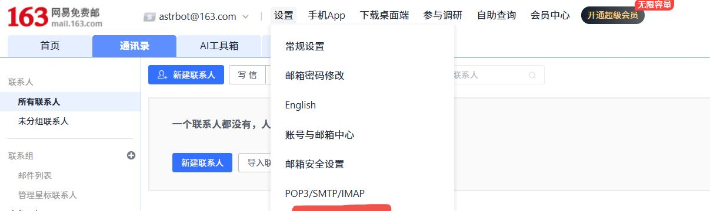

astrbot_plugin_email_tool
=========================

让 LLM 自主调用 SMTP 工具发送精美 HTML 邮件，轻松将“对话结果”发送到指定邮箱中。

特别感谢（本插件部分元素来自以下项目，感谢 [大佬](https://github.com/Futureppo) 开源）：
- [[猫猫监控]](https://github.com/Futureppo/napcat-login-status-monitor)一个用于监控 NapCat QQ)登录状态的安卓 App，支持掉线通知提醒。

## 功能亮点

- 模型可自主调用函数工具 `smtp_send_html_email` 进行发信
- 支持 to/cc/bcc 为“数组或分隔字符串（逗号/分号/空白）”
- HTML 正文 + 纯文本降级，兼容主流客户端
- SMTPS(465) 与 STARTTLS(587) 任选其一
- 域名白名单 allow_domains、dry_run 调试、smtp_debug 调试日志
- 发送间隔保护 send_interval_seconds（默认 60 秒），避免频繁误触

---

## 四步快速开始（配图）

以下指导适合不熟悉smtp邮件的新人开发者，可供您参考（以网易免费163邮箱为例）：

### 1) 打开邮箱设置

进入[网易免费163邮箱](https://mail.163.com) → 设置 → 找到 “POP3/SMTP/IMAP” 并进入配置页。

### 2) 开启 SMTP 服务

### 3) 新增并记录授权密码

### 4) 在插件配置中填写刚刚获取的对应参数

示例：

---

## 配置项一览（与 `_conf_schema.json` 保持一致）

- smtp_host(string)：SMTP 服务器主机名
- smtp_port(int)：SMTP 端口（465/587/25）
- use_ssl(bool)：使用 SMTPS(SSL/TLS) 直连
- use_starttls(bool)：使用 STARTTLS 升级加密（与 use_ssl 互斥）
- username(string)：SMTP 登录用户名
- password(string)：SMTP 授权码/密码
- from_address(string)：发件邮箱地址
- from_display_name(string)：发件人显示名
- allow_domains(list)：允许投递的目标域（留空不限制）
- send_interval_seconds(int)：发送频率限制，默认 60 秒
- dry_run(bool)：仅模拟发送，不实际投递
- smtp_debug(bool)：打印 SMTP 调试日志（包含敏感信息，谨慎开启）

---

## LLM 工具说明

名称：`smtp_send_html_email`

参数：

- to(array)：收件人邮箱（数组或分隔字符串）
- subject(string)：邮件主题
- html_body(string)：HTML 正文（建议行内 CSS）
- cc(array)：抄送（可选）
- bcc(array)：密送（可选）

返回：成功/失败的简要文本，便于模型进行后续反馈与总结。

---

## 常见问题与排障

1) 显示“发送成功”但未收到邮件？
- 打开 smtp_debug，查看 SMTP 会话是否有“被拒收收件人”条目
- 确认邮箱开通 SMTP/POP 并使用“客户端授权码”作为密码
- from_address 与登录用户名保持一致（多数服务商强制要求）
- 检查收件方垃圾箱/广告邮件
- 优化内容：正文更完整、内联样式、带品牌签名，减少反垃圾命中

2) “发送过于频繁”提示？
- 这是间隔保护在生效。可在配置里调整 send_interval_seconds。

3) 只想测试格式，不要真的发？
- 勾选 dry_run。模型会返回“已模拟发送”，不会连接 SMTP。

---

有任何使用建议，欢迎在仓库提 Issue 或 PR，一起把体验做得更顺手！

